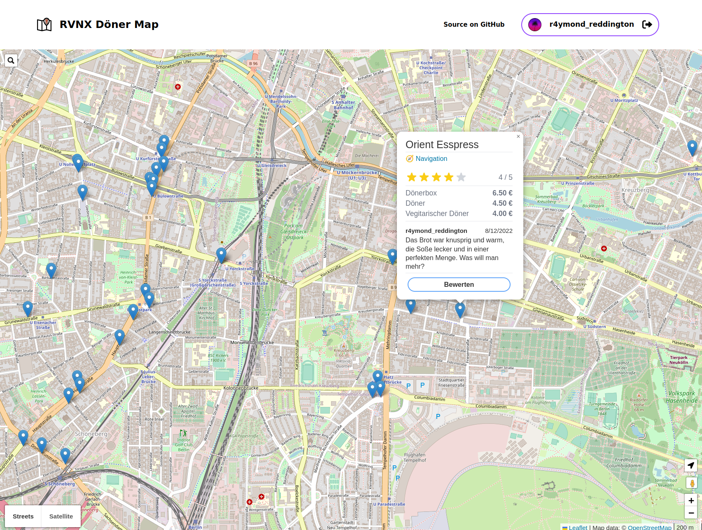

# 🥙 RVNX Döner

🔥 Hot kebabs in your area.

🕹 [Try it out yourself](https://doener.rvnx.community)

## ❓ What?

Just a map displaying kebab shops. That's it.

## ❓ Why?

A random idea I found [here](https://clips.twitch.tv/GlutenFreeFreezingDragonflySwiftRage-GZ6E7k_Sjsj7f3mw) allowing me to try out svelte.

## ⚠ Warning

First time serving high quality svelte pasta featuring the finest spaghetti code.

## 🎛 Meta

- Datasource: [OpenStreetMap](https://www.openstreetmap.org/)
  - [Query yourself](https://overpass-turbo.eu/s/1kyZ)
- Database: [PostgreSQL](https://www.postgresql.org/)
- Backend: [Go](https://go.dev/) + [Gin](https://gin-gonic.com/)
- Frontend: [Svelte](https://svelte.dev/)